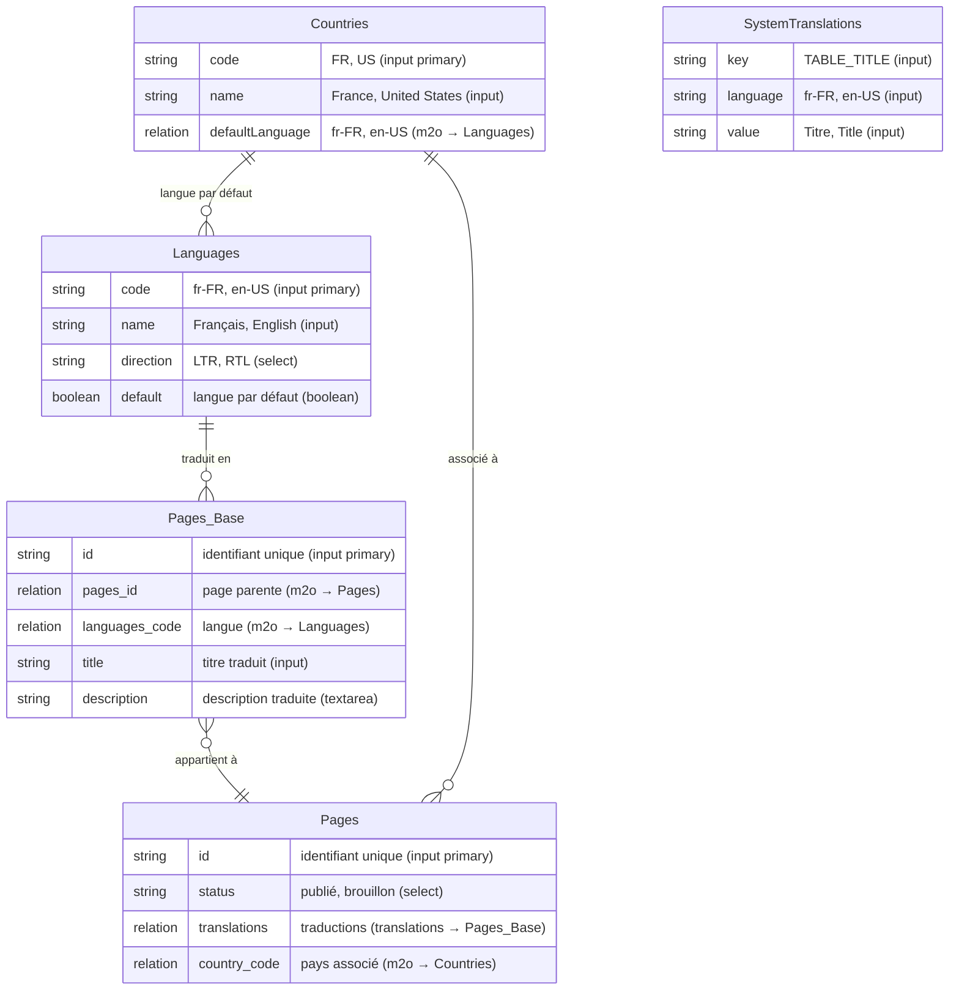

# Directus Display Translations Context

L'extension "Directus Translations Context Display" est une extension d'affichage optimisée pour le contenu multilingue dans Directus. Elle permet d'afficher automatiquement le contenu traduit dans l'interface d'administration de Directus en fonction de critères de sélection de langue avancés.

Cette extension est particulièrement utile pour les projets multilingues où le contenu est traduit dans plusieurs langues et où vous souhaitez afficher automatiquement la traduction correspondant à un pays ou une langue spécifique en provenance d'une autre collection.


## Table des matières

- [Fonctionnalités principales](#fonctionnalités-principales)
- [Installation](#installation)
  - [Étapes d'installation](#étapes-dinstallation)
  - [Arborescence des dossiers](#arborescence-des-dossiers)
- [Configuration](#configuration)
  - [Options principales](#options-principales)
- [Prérequis](#prérequis)
  - [Collection Languages](#1-collection-languages)
  - [Collection Countries](#2-collection-countries)
  - [Votre collection exemple Pages](#4-collection-pages)
  - [Votre collection exemple Pages_translations || Pages_Base](#3-collection-pages_base)
  - [Directus setting translation](#5-collection-de-traductions)
- [Schéma des relations](#schéma-des-relations)
- [Utilisation](#utilisation)
  - [Cas d'utilisation typique](#cas-dutilisation-typique)
  - [Personnalisation de l'affichage](#personnalisation-de-laffichage)
  - [Exemples de configuration](#exemples-de-configuration)
- [Fonctionnement technique](#fonctionnement-technique)
  - [Architecture](#architecture)

## Fonctionnalités principales

- **Affichage intelligent des traductions** : Affiche automatiquement la traduction correspondant à la langue sélectionnée
- **Sélection de langue dynamique** : Permet de spécifier un chemin vers un champ de langue via une notation de type `collection.field.language_code_field`
- **Mapping pays-langue configurable** : Conversion automatique des codes pays en codes de langue
- **Menu de sélection de langue** : Interface utilisateur permettant de voir et sélectionner toutes les traductions disponibles
- **Support des templates** : Personnalisation de l'affichage avec des templates incluant des variables et des traductions système
- **Gestion des cas limites** : Mécanismes de fallback pour les traductions manquantes

## Installation

```bash
# Dans le dossier de votre projet Directus
npm install -g @directus/cli
cd extensions/directus-extension-display-translations-context
npm install
npm run build
```

Ensuite, copiez le dossier `dist` dans le dossier `extensions/displays-translations-context` de votre installation Directus.

### Étapes d'installation

1. Créez la structure de dossiers suivante dans votre répertoire "extensions" :

```
votre-projet-directus/
├── extensions/
│   │   └── display-translations-context/    # Nom du dossier de l'extension
│   │       └── dist/                        # Nom du dossier de distribution
│   │       │   └── index.js                 # Fichier compilé de l'extension
│   │       └── package.json                 # Fichier json
│   └── ... autres extensions
└── ... autres fichiers Directus
```

2. Copiez le fichier `dist/index.js` généré par le build dans le dossier `extensions/display-translations-context/dist/`
3. Copiez également le fichier `package.json` dans le même dossier

### Docker Container / Coolify

```
services:
   directus:
      image: 'directus/directus:11.5.1'
      volumes:
         - 'uploads:/directus/uploads'
         - 'extensions:/directus/extensions'
         - 'templates:/directus/templates'
         - '/opt/directus/extensions/display-translations-context/package.json:/directus/extensions/display-translations-context/package.json:ro'
         - '/opt/directus/extensions/display-translations-context/dist/index.js:/directus/extensions/display-translations-context/dist/index.js:ro'
      environment:
         - EXTENSIONS_AUTO_RELOAD=true # si Environnement de développement
```

1. Redémarrez votre conteneur Directus pour que l'extension soit détectée

Cette structure est conforme à la façon dont Directus recherche les extensions dans un environnement Docker.

### Arborescence des dossiers

#### Environnement de développement

Environnement : EXTENSIONS_AUTO_RELOAD=true

```
directus-extension-display-translations-context/
├── dist/                  # Dossier de build généré par le processus de build
│   └── index.js           # Fichier compilé de l'extension
├── src/                   # Code source
│   ├── index.ts           # Point d'entrée de l'extension
│   ├── translations-context.vue      # Composant Vue pour l'affichage des traductions
│   └── shims.d.ts         # Déclarations TypeScript
├── .gitignore             # Fichiers ignorés par Git
├── package.json           # Configuration npm et dépendances
├── README.md              # Documentation principale
└── tsconfig.json          # Configuration TypeScript
```

## Configuration

Lors de la configuration de l'extension dans l'interface Directus, vous disposez des options suivantes :


### Options principales

1. **Display Field (templateDTC)**

   

   - Format d'affichage pour les traductions
   - Supporte les variables de champ avec la syntaxe `{{field}}`
   - Supporte les traductions système avec la syntaxe `[[SYSTEM_KEY]]`
   - Exemple : `[[TABLE_TITLE]]: {{title}}`

   **Exemple avancé avec traductions système :**

   Vous pouvez utiliser la syntaxe `[[TABLE_TITLE]]→{{title}}` pour afficher le nom du champ traduit suivi du contenu :

   

   Ce qui donne un résultat comme celui-ci dans l'interface :

   

   Cette configuration affiche le nom du champ dans la langue correspondante (Title, Titre, Titolo, etc.) suivi du contenu traduit, créant ainsi une interface entièrement localisée.

2. **Language Field (fieldDTC)**

   

   - Champ contenant le code de langue dans la collection de traductions (ex: Pages_Base)
   - Valeur par défaut : `language_code`
   - Peut être un chemin imbriqué comme `languages_code.code`

   **Fonctionnement technique**

   Cette option définit comment l'extension identifie le code de langue dans chaque élément de la collection de traductions (comme Pages_Base). Contrairement à ce qui pourrait être compris, ce champ ne fait référence qu'à la structure de la collection de traductions, et non à d'autres collections.

   Le code traite deux cas principaux :

   1. **Champ direct** : Si vous spécifiez un nom de champ simple (ex: `language_code`), l'extension cherchera directement cette propriété dans l'objet de traduction.

      ```
      // Élément de Pages_Base
      {
        "id": 1,
        "language_code": "fr-FR",  // ← Accès direct
        "title": "Bonjour"
      }
      ```

   2. **Chemin imbriqué** : Si vous spécifiez un chemin avec un point (ex: `languages_code.code`), l'extension suivra ce chemin pour trouver le code de langue :

      ```
      // Élément de Pages_Base
      {
        "id": 1,
        "languages_code": {  // ← Premier niveau (relation M2O vers Languages)
          "code": "fr-FR",   // ← Deuxième niveau
          "name": "Français"
        },
        "title": "Bonjour"
      }
      ```

   **Gestion intelligente des types**

   L'extension gère intelligemment différents types de valeurs dans la collection de traductions :

   - Si le premier niveau est une chaîne de caractères, elle est utilisée directement comme code de langue
   - Si le premier niveau est un objet (relation M2O), l'extension accède à la propriété spécifiée après le point
   - Si aucune valeur n'est trouvée, l'extension utilise des mécanismes de secours pour éviter les erreurs

   **Exemple concret avec Pages_Base**

   Dans une structure où Pages_Base contient une relation M2O vers la collection Languages :

   ```
   fieldDTC: "languages_code.code"
   ```

   Cela indique à l'extension de chercher d'abord l'objet `languages_code` dans chaque élément de Pages_Base, puis d'utiliser la propriété `code` de cet objet comme code de langue.

3. **Default Language Selector (selectorDTC)**

   

   - Sélecteur de langue statique ou dynamique
   - Peut être un code de langue direct (ex: `fr-FR`)
   - Ou un chemin dynamique (ex: `{{pages_id.country_code.defaultLanguage}}`)

   **Sélection flexible de la source de langue**

   Cette option permet de définir d'où provient le code de langue à utiliser pour l'affichage. Elle offre une grande flexibilité :

   1. **Code statique** : Utilisez directement un code de langue (ex: `fr-FR`, `en-US`)
   2. **Chemin dynamique** : Spécifiez un chemin vers n'importe quelle collection liée qui contient un code de langue

   **Sources de langue possibles**

   Le sélecteur peut pointer vers différentes collections, pas uniquement la collection Countries :

   - **Collection Countries** : `{{pages_id.country_code.defaultLanguage}}`
   - **Collection Users** : `{{user_created.language_preference}}`
   - **Collection Settings** : `{{site_settings.default_language}}`
   - **Collection Regions** : `{{region_id.main_language}}`
   - **Collection Organizations** : `{{organization_id.preferred_language}}`

   **Format du chemin**

   Le format du chemin suit toujours la structure : `{{collection.field.language_field}}` où :

   - `collection` est le nom du champ de relation dans votre collection actuelle
   - `field` est le champ dans la collection liée qui contient la référence à la langue
   - `language_field` est le champ contenant le code de langue

   **Exemple concret**

   Si vous avez une collection `pages` avec une relation vers `organizations` qui a une préférence de langue :

   ```
   {{organization_id.settings.language_code}}
   ```

   Cela indique à l'extension de chercher le code de langue dans le champ `language_code` du sous-objet `settings` de l'organisation liée à la page.

4. **Country to Language Mapping (mappingDTC)**

   

   - Mapping JSON pour convertir les codes pays en codes de langue
   - Utile lorsque le sélecteur renvoie un code pays au lieu d'un code de langue
   - Exemple : `{"FR": "fr-FR", "DE": "de-DE", ...}`

   **Mécanisme de secours et solution alternative**

   Cette fonctionnalité sert de mécanisme de secours dans les situations suivantes :

   1. **Problèmes d'accès aux données** : Lorsque l'extension ne peut pas accéder directement à l'objet langue complet (par exemple, en raison de restrictions de permissions)
   2. **Structure de données simplifiée** : Quand la relation pays-langue est stockée uniquement sous forme de code pays (chaîne de caractères) au lieu d'un objet complet
   3. **Erreurs API** : Pour éviter les erreurs 403 lors de la tentative d'accès à des collections liées

   **Exemple de configuration avancée**

   ```json
   {
     "FR": "fr-FR",
     "BE": "fr-BE",
     "CH": "fr-CH",
     "CA": "fr-CA",
     "DE": "de-DE",
     "AT": "de-AT",
     "IT": "it-IT",
     "ES": "es-ES",
     "US": "en-US",
     "GB": "en-GB",
     "UK": "en-GB",
     "AU": "en-AU"
   }
   ```

   **Processus de résolution**

   L'extension suit un processus en plusieurs étapes pour déterminer le code de langue :

   1. Tente d'abord d'accéder directement au champ de langue via le chemin spécifié
   2. Si cela échoue, utilise le mapping pays-langue configuré
   3. Si le pays n'est pas dans le mapping, tente d'utiliser le code pays directement comme code de langue
   4. En dernier recours, affiche un message d'erreur

   **Cas d'utilisation typique**

   Imaginons une structure où les pages sont liées à des pays, mais où l'accès direct à la relation pays-langue est limité :

   ```
   Page → Country (code: "FR") → Language (code: "fr-FR")
   ```

   Avec le mapping, l'extension peut convertir "FR" en "fr-FR" sans avoir besoin d'accéder directement à l'objet Language.

5. **Show Language Menu (menuDTC)**

   

   - Active/désactive le menu de sélection de langue
   - Permet aux utilisateurs de voir toutes les traductions disponibles

## Prérequis

Pour utiliser pleinement cette extension, vous devez configurer les collections suivantes dans votre projet Directus :

### 1. Collection Languages

Cette collection stocke les langues disponibles dans votre système.


**Champs recommandés :**

- `code` : Code de langue (ex: fr-FR, en-US) (input primary)
- `name` : Nom de la langue (input)
- `direction` : Direction d'écriture (select)
- `active` : État d'activation (boolean)


### 2. Collection Countries

Cette collection stocke les pays et leurs paramètres régionaux.


**Champs recommandés :**

- `code` : Code du pays (ex: FR, US) (input primary)
- `name` : Nom du pays (input)
- `defaultLanguage` : Relation vers la langue par défaut pour ce pays (m2o → Languages)


### 3. Collection Pages_Base

Cette collection sert de modèle pour les pages traduisibles.


**Champs recommandés :**

- `id` : Identifiant unique (primary)
- `pages_id` : Page parente (m2o → Pages)
- `languages_code` : Langue (m2o → Languages)
- `title` : Titre traduit (input)
- `description` : Description traduite (textarea)

### 4. Collection Pages

Cette collection contient les pages avec leurs traductions.


**Champs recommandés :**

- `id` : Identifiant unique (primary)
- `status` : État de publication (select)
- `translations` : Traductions (translations → Pages_Base)
- `country_code` : Pays associé (m2o → Countries)

### 5. Collection de traductions

Cette collection stocke les traductions pour chaque élément traduisible.


**Champs recommandés :**

## Schéma des relations

Le diagramme suivant illustre les relations entre les différentes collections nécessaires pour le fonctionnement de l'extension :



Ce schéma montre comment les collections sont interconnectées et les types de champs utilisés dans chaque collection. Les relations entre les collections sont essentielles pour le fonctionnement de l'extension, notamment pour la sélection dynamique de langue.

## Utilisation

### Cas d'utilisation typique

1. Créez une collection avec un champ de type "translations"
2. Configurez l'affichage du champ pour utiliser l'extension "Translations Context"
3. Définissez le template d'affichage (ex: `{{title}}`)
4. Spécifiez le champ de langue (ex: `language_code`)
5. Configurez le sélecteur de langue (ex: `{{pages_id.country_code.defaultLanguage}}`)

### Personnalisation de l'affichage

Vous pouvez personnaliser l'affichage des colonnes dans l'interface Directus :


Ce qui donne un résultat comme celui-ci :


Les parametres a mettre sur le champs "base" de type translations:


### Exemples de configuration

#### Affichage simple avec langue statique

```
Display Field: {{title}}
Language Field: language_code
Default Language Selector: en-US
Show Language Menu: true
```

#### Affichage avancé avec sélection dynamique

```
Display Field: [[ITEM_TITLE]]: {{title}} ({{description}})
Language Field: languages_code.code
Default Language Selector: {{pages_id.country_code.defaultLanguage}}
Country to Language Mapping: {"FR": "fr-FR", "DE": "de-DE", "US": "en-US"}
Show Language Menu: true
```

#### Affichage de prix de produits par pays

```
Display Field: {{price}} {{currency_symbol}}
Language Field: country_code
Default Language Selector: {{product_id.target_market}}
Country to Language Mapping: {"FR": "EUR", "DE": "EUR", "US": "USD", "GB": "GBP", "JP": "JPY"}
Show Language Menu: true
```

Cette configuration permet d'afficher automatiquement le prix d'un produit dans la devise correspondant au marché cible du produit. Par exemple, si le produit a comme marché cible "US", l'extension affichera le prix en USD. Le mapping ici convertit les codes pays en codes de devise plutôt qu'en codes de langue.

## Fonctionnement technique

### Architecture

L'extension est composée de deux fichiers principaux :

1. **index.ts** : Point d'entrée de l'extension qui définit :

   - Les métadonnées de l'extension (id, nom, description, icône)
   - Le gestionnaire de rendu côté serveur
   - Les options de configuration
   - Les types de champs supportés

2. **translations-context.vue** : Composant Vue qui gère :
   - L'affichage des traductions
   - La logique de sélection de langue
   - Le menu de sélection interactif
   - La récupération des données via l'API Directus

### Flux de données

1. Directus passe les valeurs de traduction au gestionnaire de l'extension
2. Le gestionnaire analyse les options et détermine si une sélection statique ou dynamique est nécessaire
3. Pour les sélecteurs statiques, le gestionnaire filtre directement les traductions
4. Pour les sélecteurs dynamiques, le composant Vue effectue des requêtes API pour résoudre le chemin
5. Le composant affiche la traduction correspondante et génère le menu de sélection

### Optimisations

- Minimisation des requêtes API en utilisant des requêtes combinées
- Mise en cache des résultats pour éviter les requêtes répétées
- Utilisation de computed properties pour optimiser les rendus
- Gestion intelligente des cas limites et des erreurs

## Compatibilité

Cette extension a été testé avec Directus 11.5.1.

## Dépannage

### Problèmes courants

1. **Traduction non affichée**

   - Vérifiez que le champ de langue est correctement configuré
   - Assurez-vous que le sélecteur de langue pointe vers un champ valide
   - Vérifiez que les traductions contiennent bien le code de langue attendu

2. **Erreur de chargement**

   - Vérifiez les permissions d'accès aux collections référencées
   - Assurez-vous que les chemins de sélection sont correctement formatés

3. **Mapping pays-langue non fonctionnel**

   - Vérifiez que le JSON est correctement formaté
   - Assurez-vous que les codes pays sont en majuscules

## Conclusion

L'extension "Directus Translations Context Display" offre une solution flexible et puissante pour gérer l'affichage des contenus multilingues dans Directus. Grâce à ses fonctionnalités avancées de sélection de langue et son interface utilisateur intuitive, elle simplifie considérablement la gestion des traductions dans les projets multilingues.

## Licence

Cette extension est distribuée sous licence MIT.
