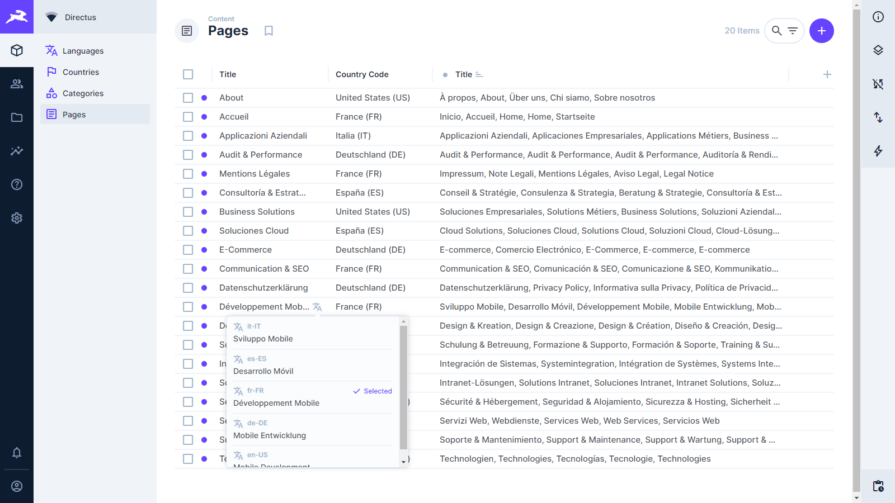

[](https://www.npmjs.com/package/directus-extension-display-translations-context)
[](https://github.com/idee-web/directus-extension-display-translations-context/blob/main/LICENSE)
[](https://github.com/idee-web/directus-extension-display-translations-context/issues)
[](https://directus.io/)

# Directus Display Translations Context

The "Directus Translations Context Display" extension is an optimized display extension for multilingual content in Directus. It automatically displays translated content in the Directus administration interface based on advanced language selection criteria.

This extension is particularly useful for multilingual projects where content is translated into multiple languages and you want to automatically display the translation corresponding to a specific country or language from another collection.

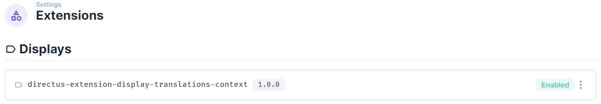

## Table of Contents

- [Key Features](#key-features)
- [Installation](#installation)
  - [Installation Steps](#installation-steps)
  - [Folder Structure](#folder-structure)
- [Configuration](#configuration)
  - [Main Options](#main-options)
- [Prerequisites](#prerequisites)
  - [Languages Collection](#1-languages-collection)
  - [Countries Collection](#2-countries-collection)
  - [Your example Pages Collection](#4-pages-collection)
  - [Your example Pages_translations || Pages_Base Collection](#3-pages_base-collection)
  - [Directus setting translation](#5-translations-collection)
- [Relationship Schema](#relationship-schema)
- [Usage](#usage)
  - [Typical Use Case](#typical-use-case)
  - [Display Customization](#display-customization)
  - [Configuration Examples](#configuration-examples)
- [Technical Operation](#technical-operation)
  - [Architecture](#architecture)

## Key Features

- **Intelligent translation display**: Automatically displays the translation corresponding to the selected language
- **Dynamic language selection**: Allows specifying a path to a language field via a notation like `collection.field.language_code_field`
- **Configurable country-language mapping**: Automatic conversion of country codes to language codes
- **Language selection menu**: User interface for viewing and selecting all available translations
- **Template support**: Customization of display with templates including variables and system translations
- **Edge case management**: Fallback mechanisms for missing translations

## Installation

```bash
# In your Directus project folder
npm install -g @directus/cli
cd extensions/directus-extension-display-translations-context
npm install
npm run build
```

Then, copy the `dist` folder to the `extensions/displays-translations-context` folder of your Directus installation.

### Installation Steps

1. Create the following folder structure in your "extensions" directory:

```
your-directus-project/
├── extensions/
│   │   └── display-translations-context/    # Extension folder name
│   │       └── dist/                        # Distribution folder name
│   │       │   └── index.js                 # Compiled extension file
│   │       └── package.json                 # JSON file
│   └── ... other extensions
└── ... other Directus files
```

2. Copy the `dist/index.js` file generated by the build into the `extensions/display-translations-context/dist/` folder
3. Also copy the `package.json` file to the same folder

### Docker Container / Coolify

```
services:
   directus:
      image: 'directus/directus:11.5.1'
      volumes:
         - 'uploads:/directus/uploads'
         - 'extensions:/directus/extensions'
         - 'templates:/directus/templates'
         - '/opt/directus/extensions/display-translations-context/package.json:/directus/extensions/display-translations-context/package.json:ro'
         - '/opt/directus/extensions/display-translations-context/dist/index.js:/directus/extensions/display-translations-context/dist/index.js:ro'
      environment:
         - EXTENSIONS_AUTO_RELOAD=true # if Development environment
```

1. Restart your Directus container for the extension to be detected

This structure conforms to how Directus looks for extensions in a Docker environment.

### Folder Structure

#### Development Environment

Environment: EXTENSIONS_AUTO_RELOAD=true

```
directus-extension-display-translations-context/
├── dist/                  # Build folder generated by the build process
│   └── index.js           # Compiled extension file
├── src/                   # Source code
│   ├── index.ts           # Extension entry point
│   ├── translations-context.vue      # Vue component for displaying translations
│   └── shims.d.ts         # TypeScript declarations
├── .gitignore             # Files ignored by Git
├── package.json           # npm configuration and dependencies
├── README.md              # Main documentation
└── tsconfig.json          # TypeScript configuration
```

## Configuration

When configuring the extension in the Directus interface, you have the following options:

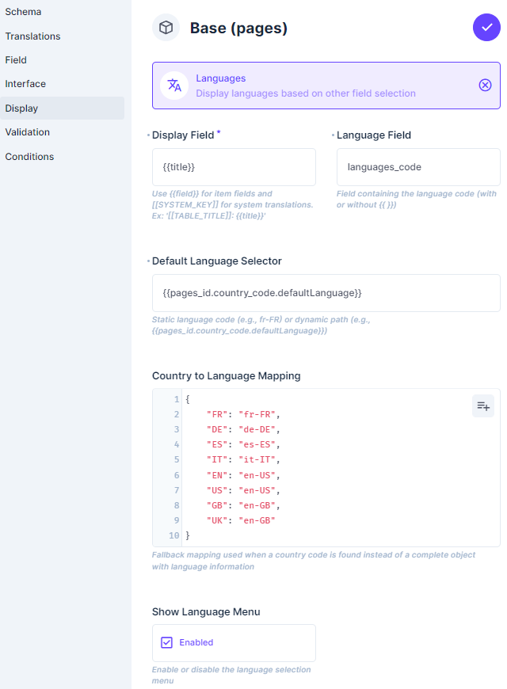

### Main Options

1. **Display Field (templateDTC)**

   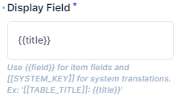

   - Display format for translations
   - Supports field variables with the syntax `{{field}}`
   - Supports system translations with the syntax `[[SYSTEM_KEY]]`
   - Example: `[[TABLE_TITLE]]: {{title}}`

   **Advanced example with system translations:**

   You can use the syntax `[[TABLE_TITLE]]→{{title}}` to display the translated field name followed by the content:

   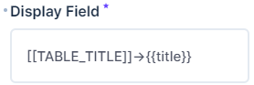

   Which gives a result like this in the interface:

   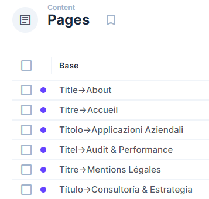

   This configuration displays the field name in the corresponding language (Title, Titre, Titolo, etc.) followed by the translated content, creating a fully localized interface.

2. **Language Field (fieldDTC)**

   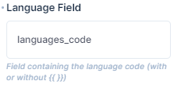

   - Field containing the language code in the translations collection (e.g., Pages_Base)
   - Default value: `language_code`
   - Can be a nested path like `languages_code.code`

   **Technical Operation**

   This option defines how the extension identifies the language code in each item of the translations collection (like Pages_Base). Unlike what might be understood, this field only refers to the structure of the translations collection, not to other collections.

   The code handles two main cases:

   1. **Direct field**: If you specify a simple field name (e.g., `language_code`), the extension will directly look for this property in the translation object.

      ```
      // Pages_Base item
      {
        "id": 1,
        "language_code": "fr-FR",  // ← Direct access
        "title": "Bonjour"
      }
      ```

   2. **Nested path**: If you specify a path with a dot (e.g., `languages_code.code`), the extension will follow this path to find the language code:

      ```
      // Pages_Base item
      {
        "id": 1,
        "languages_code": {  // ← First level (M2O relation to Languages)
          "code": "fr-FR",   // ← Second level
          "name": "Français"
        },
        "title": "Bonjour"
      }
      ```

   **Intelligent Type Management**

   The extension intelligently handles different types of values in the translations collection:

   - If the first level is a string, it is used directly as a language code
   - If the first level is an object (M2O relation), the extension accesses the property specified after the dot
   - If no value is found, the extension uses fallback mechanisms to avoid errors

   **Concrete Example with Pages_Base**

   In a structure where Pages_Base contains an M2O relation to the Languages collection:

   ```
   fieldDTC: "languages_code.code"
   ```

   This tells the extension to first look for the `languages_code` object in each Pages_Base item, then use the `code` property of that object as the language code.

3. **Default Language Selector (selectorDTC)**

   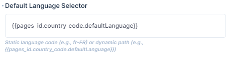

   - Static or dynamic language selector
   - Can be a direct language code (e.g., `fr-FR`)
   - Or a dynamic path (e.g., `{{pages_id.country_code.defaultLanguage}}`)

   **Flexible Language Source Selection**

   This option allows you to define where the language code to use for display comes from. It offers great flexibility:

   1. **Static code**: Directly use a language code (e.g., `fr-FR`, `en-US`)
   2. **Dynamic path**: Specify a path to any linked collection that contains a language code

   **Possible Language Sources**

   The selector can point to different collections, not just the Countries collection:

   - **Countries Collection**: `{{pages_id.country_code.defaultLanguage}}`
   - **Users Collection**: `{{user_created.language_preference}}`
   - **Settings Collection**: `{{site_settings.default_language}}`
   - **Regions Collection**: `{{region_id.main_language}}`
   - **Organizations Collection**: `{{organization_id.preferred_language}}`

   **Path Format**

   The path format always follows the structure: `{{collection.field.language_field}}` where:

   - `collection` is the name of the relation field in your current collection
   - `field` is the field in the linked collection that contains the reference to the language
   - `language_field` is the field containing the language code

   **Concrete Example**

   If you have a `pages` collection with a relation to `organizations` that has a language preference:

   ```
   {{organization_id.settings.language_code}}
   ```

   This tells the extension to look for the language code in the `language_code` field of the `settings` sub-object of the organization linked to the page.

4. **Country to Language Mapping (mappingDTC)**

   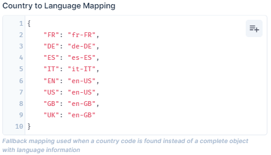

   - JSON mapping to convert country codes to language codes
   - Useful when the selector returns a country code instead of a language code
   - Example: `{"FR": "fr-FR", "DE": "de-DE", ...}`

   **Fallback Mechanism and Alternative Solution**

   This feature serves as a fallback mechanism in the following situations:

   1. **Data access issues**: When the extension cannot directly access the complete language object (for example, due to permission restrictions)
   2. **Simplified data structure**: When the country-language relationship is stored only as a country code (string) instead of a complete object
   3. **API errors**: To avoid 403 errors when attempting to access linked collections

   **Advanced Configuration Example**

   ```json
   {
     "FR": "fr-FR",
     "BE": "fr-BE",
     "CH": "fr-CH",
     "CA": "fr-CA",
     "DE": "de-DE",
     "AT": "de-AT",
     "IT": "it-IT",
     "ES": "es-ES",
     "US": "en-US",
     "GB": "en-GB",
     "UK": "en-GB",
     "AU": "en-AU"
   }
   ```

   **Resolution Process**

   The extension follows a multi-step process to determine the language code:

   1. First attempts to directly access the language field via the specified path
   2. If that fails, uses the configured country-language mapping
   3. If the country is not in the mapping, attempts to use the country code directly as a language code
   4. As a last resort, displays an error message

   **Typical Use Case**

   Imagine a structure where pages are linked to countries, but where direct access to the country-language relationship is limited:

   ```
   Page → Country (code: "FR") → Language (code: "fr-FR")
   ```

   With the mapping, the extension can convert "FR" to "fr-FR" without needing to directly access the Language object.

5. **Show Language Menu (menuDTC)**

   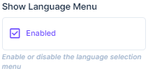

   - Enables/disables the language selection menu
   - Allows users to see all available translations

## Prerequisites

To fully use this extension, you need to configure the following collections in your Directus project:

### 1. Languages Collection

This collection stores the languages available in your system.

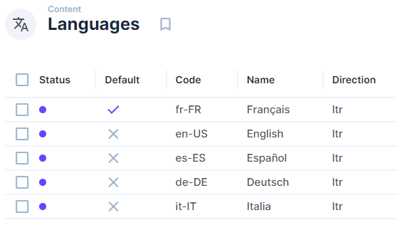

**Recommended fields:**

- `code`: Language code (e.g., fr-FR, en-US) (input primary)
- `name`: Language name (input)
- `direction`: Writing direction (select)
- `active`: Activation status (boolean)

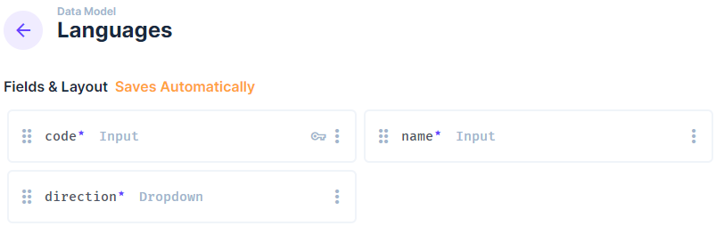

### 2. Countries Collection

This collection stores countries and their regional settings.

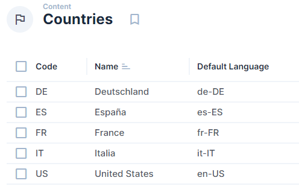

**Recommended fields:**

- `code`: Country code (e.g., FR, US) (input primary)
- `name`: Country name (input)
- `defaultLanguage`: Relation to the default language for this country (m2o → Languages)

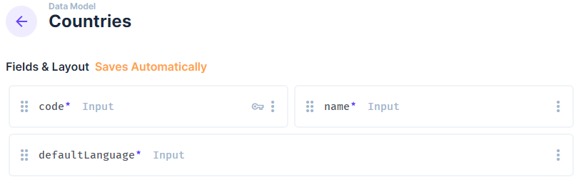

### 3. Pages Collection

This collection contains pages with their translations.

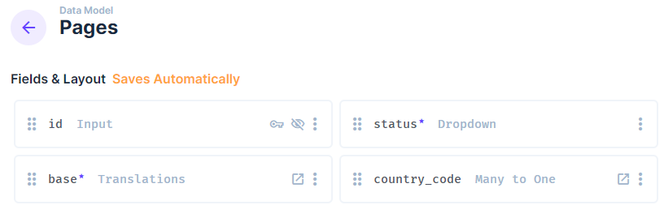

**Recommended fields:**

- `id`: Unique identifier (primary)
- `status`: Publication status (select)
- `base`: Translations (translations → Pages_Base with extension Display-Translation-Context)
- `country_code`: Associated country (m2o → Countries)

### 4. Pages_Base Collection

This collection serves as a template for translatable pages.

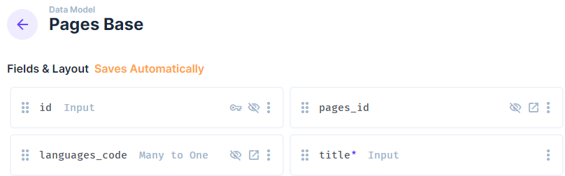

**Recommended fields:**

- `id`: Unique identifier (primary)
- `pages_id`: Parent page (m2o → Pages)
- `languages_code`: Language (m2o → Languages)
- `title`: Translated title (input)
- `description`: Translated description (textarea)

### 5. Translations Collection

This collection stores translations for each translatable item.

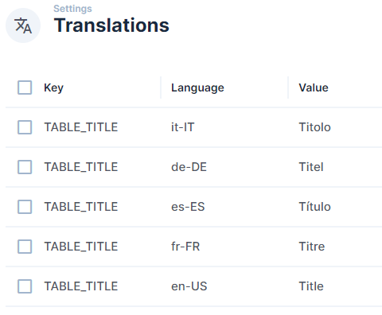

**Recommended fields:**

## Relationship Schema

The following diagram illustrates the relationships between the different collections necessary for the extension to function:

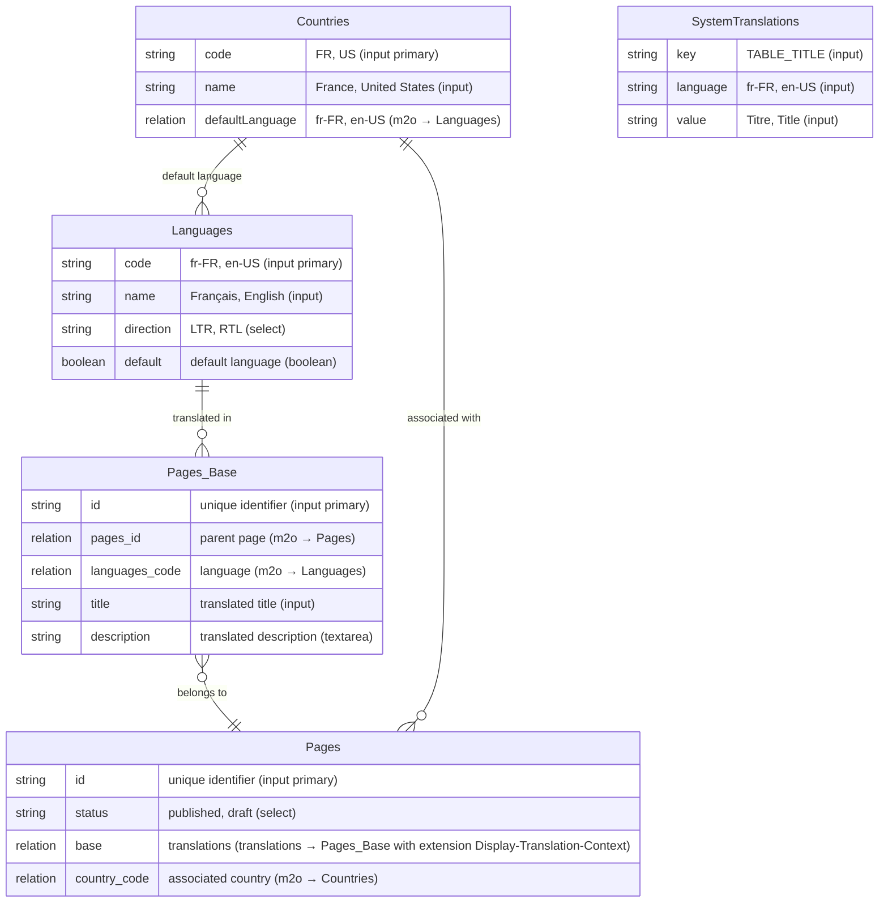

This schema shows how the collections are interconnected and the types of fields used in each collection. The relationships between collections are essential for the extension to function, particularly for dynamic language selection.

## Usage

### Typical Use Case

1. Create a collection with a "translations" type field
2. Configure the field display to use the "Translations Context" extension
3. Define the display template (e.g., `{{title}}`)
4. Specify the language field (e.g., `language_code`)
5. Configure the language selector (e.g., `{{pages_id.country_code.defaultLanguage}}`)

### Display Customization

You can customize the display of columns in the Directus interface:

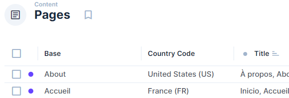

Which gives a result like this:

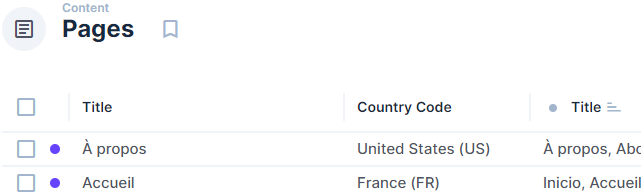

Parameters to set on the "base" field of translations type:

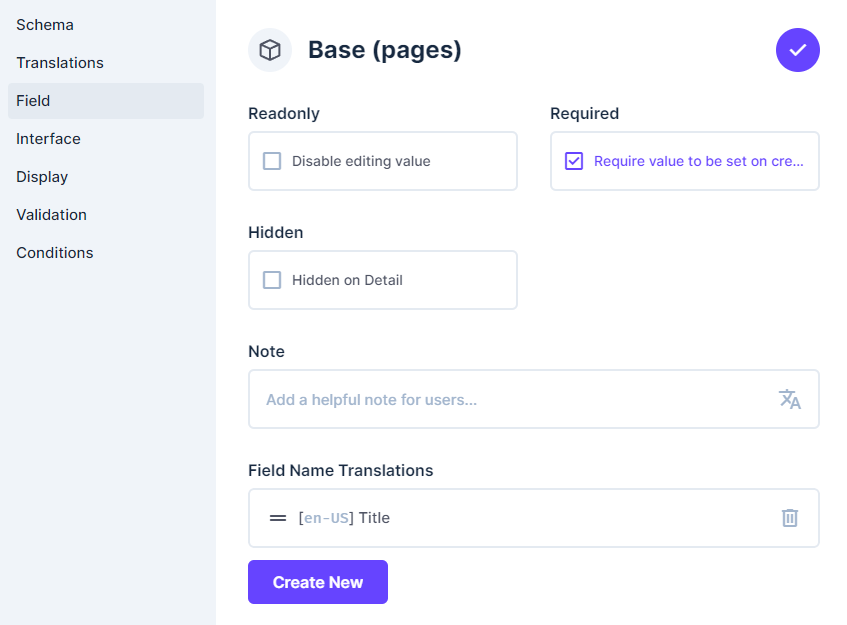

### Configuration Examples

#### Simple Display with Static Language

```
Display Field: {{title}}
Language Field: language_code
Default Language Selector: en-US
Show Language Menu: true
```

#### Advanced Display with Dynamic Selection

```
Display Field: [[ITEM_TITLE]]: {{title}} ({{description}})
Language Field: languages_code.code
Default Language Selector: {{pages_id.country_code.defaultLanguage}}
Country to Language Mapping: {"FR": "fr-FR", "DE": "de-DE", "US": "en-US"}
Show Language Menu: true
```

#### Product Price Display by Country

```
Display Field: {{price}} {{currency_symbol}}
Language Field: country_code
Default Language Selector: {{product_id.target_market}}
Country to Language Mapping: {"FR": "EUR", "DE": "EUR", "US": "USD", "GB": "GBP", "JP": "JPY"}
Show Language Menu: true
```

This configuration allows automatically displaying a product's price in the currency corresponding to the product's target market. For example, if the product has "US" as its target market, the extension will display the price in USD. The mapping here converts country codes to currency codes rather than language codes.

## Technical Operation

### Architecture

The extension consists of two main files:

1. **index.ts**: Extension entry point that defines:

   - Extension metadata (id, name, description, icon)
   - Server-side rendering handler
   - Configuration options
   - Supported field types

2. **translations-context.vue**: Vue component that manages:
   - Translation display
   - Language selection logic
   - Interactive selection menu
   - Data retrieval via the Directus API

### Data Flow

1. Directus passes translation values to the extension handler
2. The handler analyzes the options and determines if static or dynamic selection is needed
3. For static selectors, the handler directly filters translations
4. For dynamic selectors, the Vue component makes API requests to resolve the path
5. The component displays the corresponding translation and generates the selection menu

### Optimizations

- Minimization of API requests by using combined queries
- Caching of results to avoid repeated queries
- Use of computed properties to optimize renders
- Intelligent handling of edge cases and errors

## Compatibility

This extension has been tested with Directus 11.5.1.

## Troubleshooting

### Common Issues

1. **Translation not displayed**

   - Check that the language field is correctly configured
   - Make sure the language selector points to a valid field
   - Verify that the translations contain the expected language code

2. **Loading error**

   - Check access permissions to referenced collections
   - Make sure selection paths are correctly formatted

3. **Country-language mapping not working**

   - Check that the JSON is correctly formatted
   - Make sure country codes are in uppercase

## Conclusion

The "Directus Translations Context Display" extension offers a flexible and powerful solution for managing the display of multilingual content in Directus. Thanks to its advanced language selection features and intuitive user interface, it significantly simplifies translation management in multilingual projects.

## License

This extension is distributed under the MIT license.

## Community Feedback

This extension has been primarily tested with Directus 11.5.1. If you use it with other versions of Directus, I would greatly appreciate your feedback on compatibility and any issues you encounter.

### How to Contribute

- **Report Issues**: If you encounter any bugs or compatibility issues, please [open an issue](https://github.com/idee-web/directus-extension-display-translations-context/issues) on GitHub
- **Share Your Experience**: Let me know how you're using the extension and what features you'd like to see added
- **Test on Different Versions**: If you're using a different version of Directus, please share your experience to help improve compatibility

Your feedback is invaluable for improving this extension and making it work well for everyone in the Directus community!

### Contact

- GitHub: [idee-web/directus-extension-display-translations-context](https://github.com/idee-web/directus-extension-display-translations-context)
- Website: [www.idee-web.com](https://www.idee-web.com)
