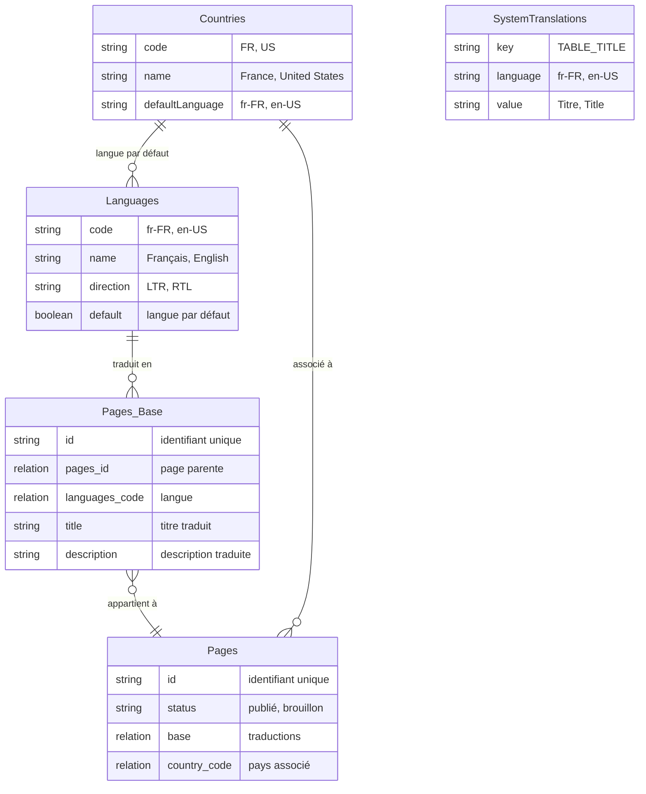
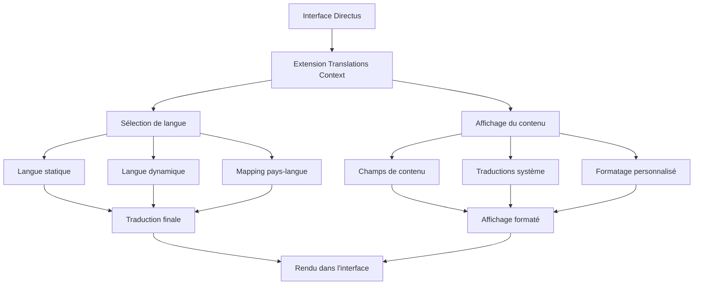
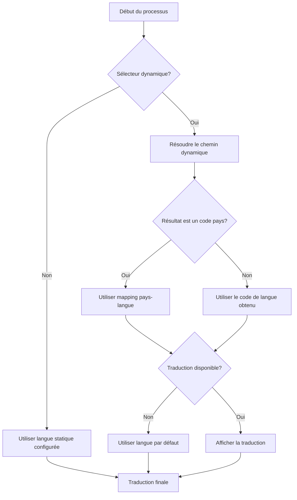
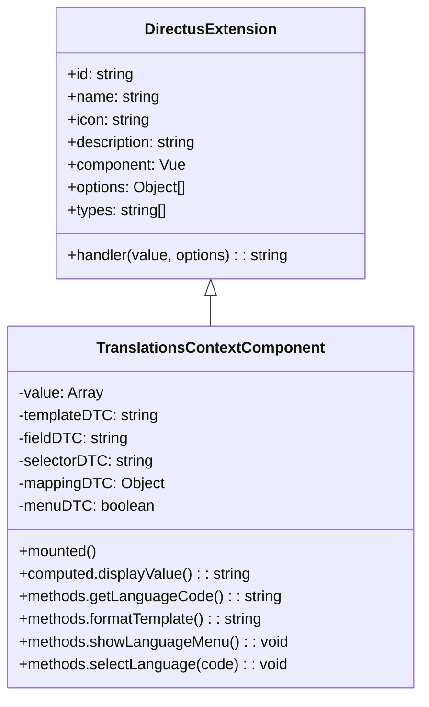
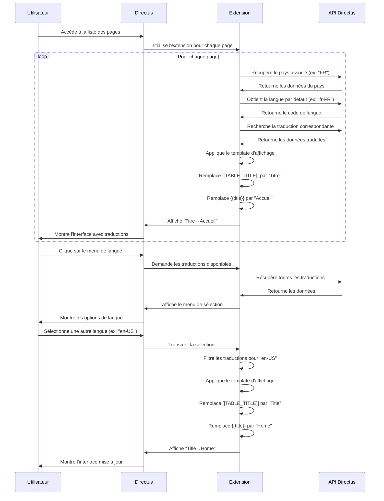
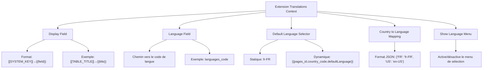

# Schéma d'architecture visuel - Directus Translations Context

Ce document présente l'architecture de l'extension Directus Translations Context sous forme de diagrammes visuels utilisant la syntaxe Mermaid.

## Relations entre collections

## Flux de données

## Processus de sélection de langue

## Architecture technique

## Exemple de flux complet

## Configuration de l'extension

